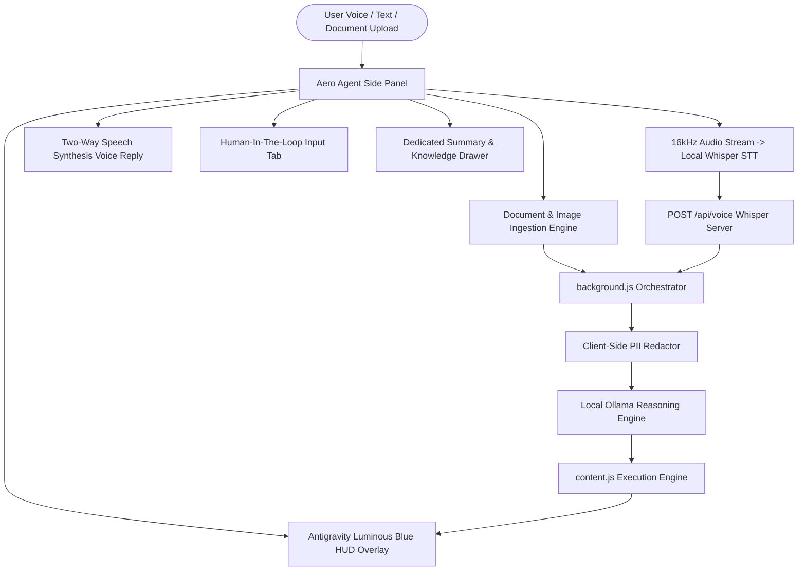

# Architectural Implementation Plan: SIH26171 Autonomous Privacy-Preserving Vision Agent

This comprehensive implementation plan addresses the full **SIH / ISRO Problem Statement** requirements and lays out the step-by-step architecture for the **6 major requested features**:

1. **Multi-Format Document Ingestion** (Images, PDFs, Word/Text docs)
2. **Interactive Human-In-The-Loop (HITL) Prompt Tab** (Fixing false completion on logins, 2FA, and credentials)
3. **High-Accuracy Multilingual Voice Recognition** (Local Whisper-powered pipeline for technical terms and Indian accents)
4. **Dedicated Summary & Explanation Knowledge Tab** (Rich, structured drawer for website/document summaries)
5. **Antigravity-Style Luminous Blue Translucent HUD Overlay** (Visual feedback showing real-time agent execution on web pages)
6. **Interactive Two-Way Voice Response (TTS)** (Agent verbally announcing actions and milestones)

---

## 1. Audit Against Official SIH / ISRO Problem Statement

| PS Component / Metric | Weight | Current Codebase Status | Architectural Upgrade & Solution |
| :--- | :--- | :--- | :--- |
| **Accuracy of visual context from screen** | **25%** | DOM tree snapshot in `content.js`, canvas crop in `offscreen.js`, and VLM (`moondream:latest`) on local server. | Implement high-density visual state extractor combining DOM bounding boxes and VLM scene understanding. |
| **Recall & precision for sensitive/PII data** | **20%** | Regex and DOM-based PII detector in `pii_detector.js` (Aadhaar, PAN, emails, phones, passwords). | Expand detection with context-aware semantic obfuscation and password/token masking before any payload leaves the client. |
| **Precision of visual redaction** | **20%** | Canvas blackout and security border overlay in `pii_redactor.js`. | Ensure 100% of screenshots sent to `/api/vlm` or `/api/plan` pass through `PIIRedactor.redactScreenshot` first, logging cryptographic hashes to `audit_chain.jsonl`. |
| **Client-side resource utilization** | **20%** | Lightweight extension with sub-50MB memory footprint and offscreen canvas processing. | Keep client-side footprint minimal by offloading heavy inference to local server (`127.0.0.1:5000`) while redacting in client DOM memory. |
| **Overall end-to-end task latency** | **15%** | Sub-200ms DOM action execution via direct script execution in `world: 'MAIN'`. | Maintain sub-200ms action dispatch; use fast-path heuristics before triggering heavy VLM cycles. |

---

## 2. Critical Problem Statement Fix: Login & User Credentials (HITL)

> [!CAUTION]
> **Issue Identified**: The agent currently marks a task as completed prematurely when it hits a login screen, SSO prompt, or forms requiring unknown credentials.
>
> **Solution**:
> - Introduce an explicit **Human-in-the-Loop (HITL)** state: `waiting_user_input`.
> - When the agent detects login walls, 2FA/OTP prompts, or missing user information:
>   1. **Pauses execution** immediately.
>   2. **Verbal announcement**: *"I have paused at the login screen. Please enter your credentials or complete the sign-in so I can proceed."*
>   3. **Opens the "Action Required" Tab / Modal** in the side panel with an intuitive interface.
>   4. Once the user enters the information or clicks **"I've Signed In — Continue Task"**, the agent seamlessly resumes its automated step queue.

---

## 3. High-Accuracy Voice Recognition Overhaul

> [!WARNING]
> **Issue Identified**: The native browser Web Speech API performs poorly with technical words ("LeetCode", "Sudoku", "Topological", "compile") and varied accents.
>
> **Solution**:
> - Upgrade from pure browser `webkitSpeechRecognition` to a **Dual-Engine Audio Pipeline**:
>   - **Capture**: Offscreen audio processor records clean 16kHz mono PCM audio.
>   - **Transcription**: Sends recorded WAV to `POST http://127.0.0.1:5000/api/voice` powered by local Whisper (`faster-whisper` / `qwen2.5` speech processing).
>   - **Multilingual Support**: High accuracy for Indian English, Hindi, and Kannada.
>   - **Real-Time Visualizer**: Audio waveform indicator on the mic button so users know their voice is being captured clearly.

---

## 4. End-to-End System Architecture

---

## 5. Detailed Feature Specifications

### Feature 1: Multi-Format Document Ingestion (Images / PDFs / Docs)
- **UI Element**: Attachment clip button in the Aero Agent chat box.
- **Supported Formats**: `.pdf`, `.png`, `.jpg`, `.jpeg`, `.txt`, `.md`, `.json`, `.csv`.
- **Processing**:
  - PDFs: Parsed client-side using `pdf.js` or converted to text chunks.
  - Images: Encoded as base64 and routed to local VLM (`moondream:latest`) for visual inspection.
  - Text/Docs: Text extracted and attached to the goal context.
- **Use Cases Supported**:
  - *"Summarize this uploaded report.pdf"*
  - *"Fill the registration form using my attached resume.pdf"*
  - *"Solve the math or coding problem shown in this uploaded screenshot.png"*

---

### Feature 2: Interactive Human-In-The-Loop (HITL) Prompt Tab
- **Trigger Conditions**:
  - Detecting password fields, 2FA/OTP inputs, or captcha challenges.
  - Detecting missing required information (e.g. user handle, delivery address, custom choice).
- **Behavior**:
  - Step queue transitions to `status: 'waiting_user_input'`.
  - Side panel opens the **Action Required** drawer with:
    - Contextual prompt explaining what is needed.
    - Direct input field(s) for the user.
    - Quick-action button: *"Continue Execution"*.
  - Live HUD on the webpage displays an amber banner: `⏸️ Aero Agent Paused: User Action Required`.

---

### Feature 3: High-Accuracy Whisper Multilingual Voice Pipeline
- **Audio Capture**: `offscreen.js` captures raw audio through `AudioContext` downsampled to 16,000 Hz, 16-bit Mono PCM.
- **Server Endpoint**: `POST /api/voice` takes base64 audio and transcribes via local Whisper model with language auto-detection (en, hi, kn).
- **Phonetic Normalization**: Cleans tech terms and homophones (e.g., *"slove"* $\rightarrow$ *"solve"*, *"lead code"* $\rightarrow$ *"leetcode"*, *"complie"* $\rightarrow$ *"compile"*).

---

### Feature 4: Dedicated Summary & Knowledge Tab
- **UI Structure**: A third top-level navigation tab in `popup.html`:
  - `[Actions]` | `[Summary]` | `[Audit Log]`
- **Display Features**:
  - **Executive Summary** card.
  - **Key Highlights** bullet list with tags.
  - **Structured Data Table** for comparative figures/metrics.
  - **Action Items** checklist.
  - **Export Buttons**: Copy Markdown, Save as Text, or Ask Follow-up Question.

---

### Feature 5: Antigravity-Style Luminous Blue Translucent HUD Overlay
- **Injected Element**: `#aero-agent-hud-overlay` in `content.js`.
- **Visual Design**:
  - **Vignette Glow**: Subtle, semi-transparent deep blue luminous ambient border (`rgba(59, 130, 246, 0.2)` fading to transparent).
  - **Top Floating Status Pill**: Sleek glassmorphic badge at top center:
    - `⚡ Aero Agent is working: [Current Action Name]` with a pulsing cyan indicator.
  - **Target Element Reticle**: Highlight box with smooth animated glow around the exact button/input being clicked or typed into.
  - Automatically activates when agent enters `acting` or `thinking` state; fades out smoothly on task completion or pause.

---

### Feature 6: Interactive Two-Way Voice Response (TTS)
- **Engine**: Client-side `window.speechSynthesis` with optimized natural voice selection.
- **Header Controls**: Audio toggle button (🔊 / 🔇) in the Aero Agent panel header with persisted state.
- **Announcements**:
  - Task kickoff: *"Starting task: [Goal]"*
  - Key transitions: *"Navigating to LeetCode...", "Synthesizing C++ solution...", "Running compiler...", "Submitting..."*
  - HITL alert: *"I need your input to continue with this login. Please see the side panel."*
  - Task success: *"Accepted! All testcases passed successfully."*

---

## 6. Implementation Stages & Verification Plan

### Phase 1: Visual HUD & Interactive Two-Way Voice
1. Inject Antigravity-style blue translucent HUD overlay in `content.js`.
2. Add speech synthesis voice output in `popup.js` with mute/unmute control.
3. **Verification**: Start any task and verify the luminous blue HUD glow appears and the agent verbally announces its progress.

### Phase 2: HITL User Input Tab & Login Handling
1. Add `#hitl-modal` drawer in `popup.html` and `popup.js`.
2. Update `background.js` to detect login/credential walls, pause execution, and wait for user confirmation.
3. **Verification**: Run a login workflow; confirm the agent pauses cleanly, prompts the user, and resumes once input is provided.

### Phase 3: High-Accuracy Voice Recognition (Whisper)
1. Implement audio transcription handler in `server/app.py` via `POST /api/voice`.
2. Connect `offscreen.js` WAV encoder to send audio upon mic button release.
3. **Verification**: Speak complex coding commands with Indian accents and verify high-accuracy transcription.

### Phase 4: Document Ingestion & Dedicated Summary Tab
1. Add file upload handler in `popup.html` and `popup.js` supporting PDF/Image/Text.
2. Add dedicated **Summary Tab** in `popup.html` with rich markdown formatting.
3. Connect document context into `background.js` task execution.
4. **Verification**: Upload a PDF or screenshot and prompt the agent to summarize or act upon it.
